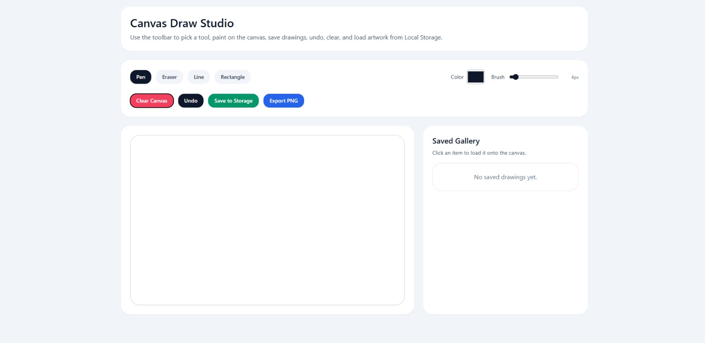

# Canvas Draw Studio

A lightweight, browser-based drawing application for creating, editing, saving, and exporting digital sketches through an interactive canvas interface.

---

## Application Preview

<p align="center">
  
</p>

<p align="center">
  
</p>

---

## Overview

Canvas Draw Studio provides a focused drawing workspace built around the HTML Canvas API. The application supports freehand drawing, basic shapes, color and brush controls, drawing history, local persistence, and PNG export.

The project is designed as a client-side application with no backend dependency.

---

## Features

- Freehand drawing with adjustable brush size
- Pen and eraser tools
- Line and rectangle drawing
- Custom stroke color selection
- Undo support
- Canvas clearing
- Local Storage-based drawing persistence
- Saved drawing gallery
- Loading previously saved drawings
- PNG export

---

## Technology

**Frontend**
- React
- JavaScript
- Vite
- Tailwind CSS

**Browser APIs**
- HTML Canvas API
- Web Storage API

---

## Getting Started

### Requirements

- Node.js
- npm

### Installation

```bash
git clone https://github.com/keerthithummalapalli/Canvas-basic.git
cd Canvas-basic
npm install

Development

npm run dev

The development server will provide a local URL in the terminal.

Production Build

npm run build

To preview the production build locally:

npm run preview


---

Project Structure

Canvas-basic/
├── public/
├── src/
├── screenshots/
│   ├── Canvas-preview.png
│   └── canvas-preview2.png
├── index.html
├── package.json
├── package-lock.json
├── postcss.config.js
├── tailwind.config.js
├── vite.config.js
└── README.md


